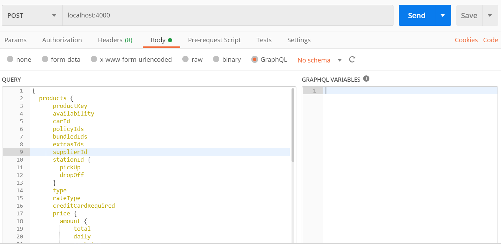
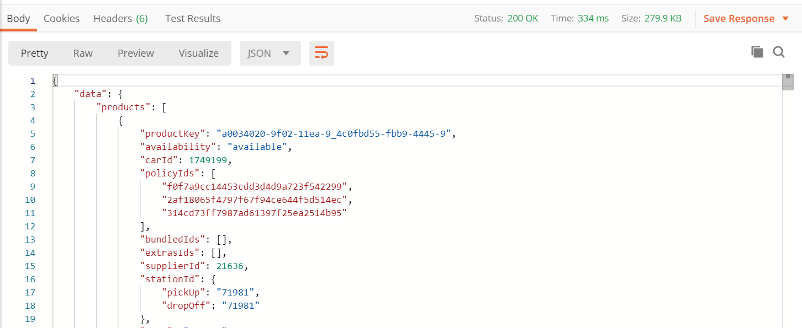

# Install Dependencies

`npm install`

# Run 

`npm start`

The app will start running on http://localhost:4000

# Supported GraphQL Schema

`
{
  products {
      productKey
      availability
      carId
      policyIds
      bundledIds
      extrasIds
      supplierId
      stationId {
        pickUp
        dropOff
      }
      type
      rateType
      creditCardRequired
      price {
        amount {
            total
            daily
            payLater
            payNow
            taxesAndFees
        }
        supplierAmount {
            total
            daily
            payLater
            payNow
            taxesAndFees
        }
      }
      priceBreakdown {
        amount
        supplierAmount
        quantity
        unit
      }
      fees {
        amount
        supplierAmount
        description
        unit
      }
      supplierCurrency
      deeplink
      isDeductibleCDWStandardIncluded
      isDeductibleCDWPremiumIncluded
  }
  cars {
    id
    acriss
    make
    model
    doors
    seats
    luggage
    fuelType
    image
    isAirConditioning
    transmission
    carGroup
  }
  suppliers {
    id
    name
    logo
    countryCode
    extra {
        available
    }
  }
  stations {
    id
    supplierId
    name
    address {
        addressLine1
        addressLine2
        city
        state
        postalCode
    }
    phoneNumber
    fax
    latitude
    longitude
    timeZone
    stationDetail
    generalInformation
    openingHours {
        Monday {
            from
            to
        }
        Tuesday {
            from
            to
        }
        Wednesday {
            from
            to
        }
        Thursday {
            from
            to
        }
        Friday {
            from
            to
        }
        Saturday {
            from
            to
        }
        Sunday {
            from
            to
        }
    }
    isInAirport
    isInTerminal
    iataCode
    status
    stationType
  }
  policyItems {
    id
    code
    description
    classObjectBillingTerms {
        text
    }
    mandatory
    inclusive
    exclusive
    supportedCountries
  }
  productGroups
  bundles {
      id
      name
      description
      policyUrl
      supportedCountries
  }
  extras {
    id
    code
    description
  }
  meta {
      brand
      partner
      pointOfSale
      timestamp
      deeplink_url
      pointOfSaleCurrencyCode
      tripDuration
      merchantInventory
      search_resp_timestamp
      search_req_timestamp
  }
  locations {
      id
      isDropOff
      isPickUp
      value
  }
  locationDistance {
      stationId
      unit
      value
  }
}`

# Postman Request & Response

